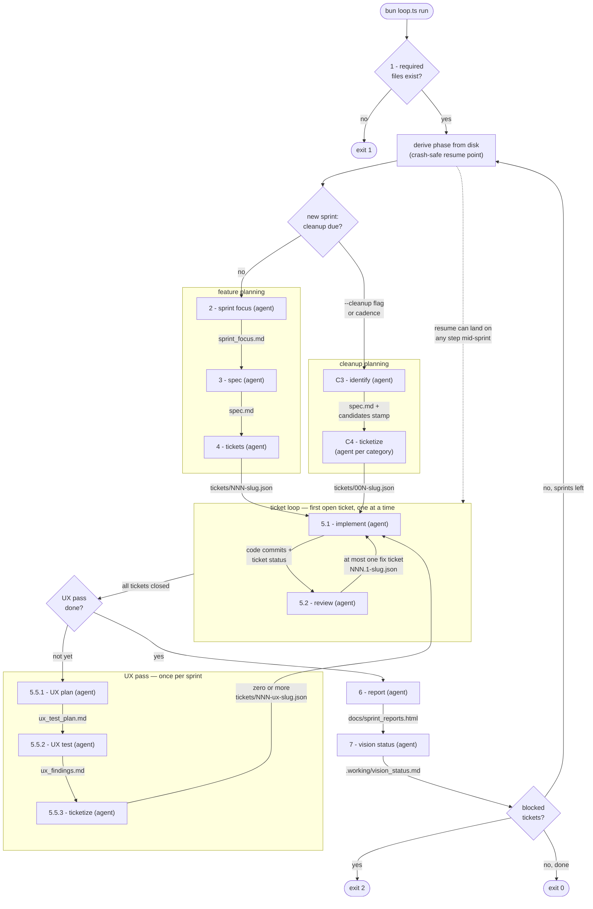

# mmm-loop

An autonomous, sprint-based agent loop for Claude Code. Point it at a project
with a written vision and run it: each run plans one sprint, implements and
reviews it ticket by ticket, UX-tests what it built, writes an HTML report,
and updates its own picture of where the project stands — then halts so a
human can look before the next run.

A deterministic orchestrator (TypeScript on [Bun](https://bun.sh)) drives the
loop; fresh `claude -p` processes do only the creative work inside each step.
[How the loop works](#how-the-loop-works) below has the details;
[docs/specification.md](docs/specification.md) is the full design.

Inspired by [wsff](https://github.com/humanlayer/advanced-context-engineering-for-coding-agents/blob/main/wsff.md),
[mattpocock/skills](https://github.com/mattpocock/skills), and
[ralph](https://github.com/snarktank/ralph).

## Quick start

Requirements in the target project: `bun` and `claude` on the PATH, and a git
repository.

```bash
# 1. Copy the bundle in — no package, no global install; the copy is yours to edit
cp -r <this-repo>/scripts/mmm-loop <your-project>/scripts/mmm-loop
cd <your-project>

# 2. Scaffold the files the loop needs (never overwrites existing files)
bun scripts/mmm-loop/loop.ts init

# 3. Fill in docs/CONTEXT.md and docs/vision.md by hand

# 4. Run one sprint
bun scripts/mmm-loop/loop.ts run
```

`init` scaffolds four files:

- `docs/CONTEXT.md` — always-relevant context given to every agent: what the
  project is, tech stack, how to run and test, conventions.
- `docs/vision.md` — what to build; the loop's north star. Write it for an
  agent deciding what to do next.
- `.working/vision_status.md` — the loop's own picture of where the project
  stands (starts as "nothing is built yet").
- `.working/learnings.md` — append-only one-liners agents leave for each
  other (gotchas, conventions).

`CONTEXT.md` and `vision.md` are the two files the whole loop feeds on — fill
them in before the first run.

Heads-up: agents run with `--dangerously-skip-permissions` by default —
that's what autonomous means. See [Tuning](#tuning) to change it.

## Running

One invocation = one full sprint by default. Chain sprints for an overnight
run:

```bash
bun scripts/mmm-loop/loop.ts run --max-sprints 3
```

A sprint that ends with blocked tickets always halts the run, regardless of
sprints remaining.

Every third sprint (the cadence is configurable, `0` disables it) runs as a
**cleanup sprint** instead of a feature sprint — see
[Cleanup sprints](#cleanup-sprints). Force one with:

```bash
bun scripts/mmm-loop/loop.ts run --cleanup
```

(`--cleanup` applies to the first sprint the run *creates*; if the run only
resumes and finishes an in-progress sprint, it has no effect and says so.)

### Exit codes

| Code | Meaning |
|------|---------|
| 0 | Requested sprints completed; nothing blocked |
| 1 | Validation failed, or a step failed its postcondition twice |
| 2 | Sprint finished (report + vision status written) but tickets need human intervention |

## What a sprint leaves behind

Everything the loop produces is committed to git as it goes:

```
docs/
  sprint_reports.html          # step 6's report (open it in a browser)
.working/                      # the loop's memory — tracked in git
  vision_status.md
  learnings.md
  sprints/
    01-mvp/
      sprint_focus.md
      spec.md
      ux_test_plan.md                # step 5.5's plan
      ux_findings.md                 # step 5.5's findings (stamped when ticketized)
      tickets/
        001-first-thing.json
        001.1-fix-first-thing.json   # review-created fix ticket
        002-second-thing.json
        003-ux-fix-help.json         # UX-finding ticket
```

Ticket filenames are execution order; a fix ticket `NNN.1` sorts directly
after its parent. Each ticket records its own state (`done`, `reviewed`,
`needs_human_intervention`, per-test `passes`) and the commit SHAs that
implemented it.

`docs/sprint_reports.html` is the human-facing summary: per-sprint overview,
diagram, key decisions, a banner for blocked tickets, UX findings that were
not fixed, and a click-to-reveal quiz about the introduced code.

## When the loop gets stuck (exit 2)

1. Open `docs/sprint_reports.html` — blocked tickets are the banner at the
   top — or grep for `"needs_human_intervention": true` in
   `.working/sprints/*/tickets/`.
2. Edit the ticket JSON directly: set `"needs_human_intervention": false`,
   clear the reason, and write your guidance into `"human_note"`.
3. Run again:

```bash
bun scripts/mmm-loop/loop.ts run
```

The loop resumes exactly at that ticket, and the implement agent's prompt
includes your note.

## How the loop works

All control flow is plain code: the orchestrator validates files, derives the
current phase from disk, picks tickets, records commits, and applies stop
conditions. LLM agents — one fresh `claude -p` process per step, each given a
purpose-built prompt and only the files that step needs — do only the
creative work. After every agent run the orchestrator checks a programmatic
**postcondition** (file exists, stamp parses, ticket JSON validates). A
failed check gets one retry with the failure description appended to the
prompt; a second failure stops the run (exit 1). Nothing checkable by code is
ever delegated to an LLM.

Every box marked "agent" below is one such fresh process; edge labels are the
artifacts each step hands to the next.



### The steps

| Step | Prompt | What the agent does | Writes |
|---|---|---|---|
| 1 validate | — (plain code) | checks `CONTEXT.md`, `vision.md`, `vision_status.md` exist; else exit 1 | — |
| 2 sprint focus | `02-sprint-focus` | picks ONE conservative focus area for the sprint, and why | `sprint_focus.md` |
| 3 spec | `03-spec` | turns the focus into testable goals (no statuses — that's the tickets' job) | `spec.md` |
| 4 tickets | `04-tickets` | breaks the spec into small, ordered, independently completable tickets | `tickets/NNN-slug.json` |
| 5.1 implement | `05-implement` | implements the first open ticket, commits code, runs the ticket's tests, self-reports `passes`, flips `done` (or blocks itself with a reason) | code commits, ticket JSON |
| 5.2 review | `05-review` | reviews exactly the diff of the ticket's recorded commits; findings worth fixing become at most one fix ticket | `tickets/NNN.1-slug.json` (optional) |
| 5.5.1 UX plan | `05.5-ux-plan` | decides how (and whether) the sprint's user-facing delta can be tested agentically — existing tools only, no new dependencies | `ux_test_plan.md` |
| 5.5.2 UX test | `05.5-ux-test` | executes the plan the way a user would (CLI, API, docs count too); "No findings." is a valid outcome | `ux_findings.md` |
| 5.5.3 UX ticketize | `05.5-ux-tickets` | turns findings worth fixing into normal tickets that run in the same sprint | `tickets/NNN-ux-slug.json` (zero or more) |
| 6 report | `06-report` | creates/extends the report: summary, diagram, key decisions, blocked banner, unfixed UX findings, quiz | `docs/sprint_reports.html` |
| 7 vision status | `07-vision-status` | rewrites the status file to match reality — fixed template, replaced each sprint, ~120 lines max | `.working/vision_status.md` |
| C3 identify | `03-cleanup-identify` | cleanup variant of 2–3: at most one obvious-win candidate per category (architecture, clean-code, docs) | `spec.md` with a candidates stamp |
| C4 ticketize | `04-cleanup-tickets` | cleanup variant of 4: one agent run per `yes` category, one ticket each with fixed IDs `001`–`003` | `tickets/00N-slug.json` |

Git is part of the design: the orchestrator commits every artifact
deterministically (`chore(loop): sprint NN spec`, `... tickets`, `... ux
findings`, ...), and the implement agent commits code as `feat(sNN/TTT): ...`
(`fix` for fix tickets, `refactor`/`docs` for cleanup tickets) so commits and
tickets stay greppable both ways. After each implement run the orchestrator
records the run's new commit SHAs into the ticket's `commits` array — the
review step diffs exactly those commits, not "the last commit".

### Staying in the smart zone

Agent loops degrade when context balloons and tasks blur together. The loop
keeps every invocation small and sharply scoped:

- **Fresh process, minimal context.** No conversation carries over between
  steps. Each prompt states the agent's single purpose, its inputs, its exact
  expected output, and what not to do.
- **Small units of work.** The sprint-focus prompt is deliberately
  conservative (one coherent focus area, not more); tickets are small and
  ordered; the implement loop takes exactly one ticket at a time.
- **Hard bounds against spinning.** One retry per step, then die. At most one
  fix ticket per reviewed ticket; reviews of fix tickets never create
  tickets. One UX pass per sprint, no re-test after UX fixes land.
- **Code judges, not LLMs.** Postconditions, phase selection, ticket
  ordering, and stop conditions are all plain code — there is no "is the
  vision done?" LLM gate anywhere in the control path.
- **Deliberately tiny shared memory.** Agents pass notes through
  `.working/learnings.md` one-liners, and `vision_status.md` is rewritten
  (not appended) each sprint against a fixed template.

### Cleanup sprints

Every `CLEANUP_CADENCE`-th created sprint (default 3 → sprints 03, 06, 09,
...) — or any sprint forced with `--cleanup` — swaps steps 2–4 for C3/C4 and
keeps everything else. The folder is exactly `NN-cleanup` (a reserved slug,
created by the orchestrator before any agent runs) and there is no
`sprint_focus.md` — the folder name is the focus.

C3 explores the codebase and writes a `spec.md` whose first line is a
machine-readable stamp (`_Candidates: architecture=yes, clean-code=none,
docs=yes_`); C4 then runs once per `yes` category — architecture (`001`)
first, docs (`003`) last, so the docs ticket documents the post-cleanup
state. The bar is deliberately high: a candidate must be an obvious, certain,
single-ticket win. **Finding nothing is a valid, successful outcome** — the
empty sprint still runs its UX pass (doubling as a regression check, since
cleanup must not change behavior) and reports that nothing needed cleaning.
`docs/vision.md` is human-authored and never touched by the loop.

### Crash safety and resume

There is no state file. On every `run`, the orchestrator derives the current
phase purely from what's on disk: which sprint folders exist, each ticket's
`done`/`reviewed`/`needs_human_intervention` fields, the
`_Ticketized: no|yes_` stamp on `ux_findings.md`, whether the report contains
`<section id="sprint-NN">`, and the `_Last updated: sprint NN_` stamp on
`vision_status.md`. Kill the loop at any point and rerun — it re-enters
exactly where the files say it left off. This is also why `.working/` must
stay tracked in git.

Usage limits are waited out, not fatal: when a `claude` run dies because the
account hit its usage/rate limit, the loop parses the reset time out of the
message when it carries one, prints a single line saying how long it will
wait and when it resumes, sleeps, and re-runs the same attempt — without
consuming the postcondition retry. Killing the process during the wait loses
nothing (rerun and it derives the same step). The knobs live in the
`RATE_LIMIT` constant in `scripts/mmm-loop/config.ts`; the env vars
`MMM_LOOP_RL_DEFAULT_WAIT_MS` and `MMM_LOOP_RL_RESET_MARGIN_MS` override the
waits for one-off runs.

## Tuning

All knobs live in the copy inside your project:

- **`scripts/mmm-loop/config.ts`** — per-step model, reasoning effort, and
  max turns (defaults: Fable 5 at max effort for planning/implement/review,
  Haiku for the mechanical vision-status rewrite), the cleanup-sprint cadence
  (`CLEANUP_CADENCE`, default every 3rd sprint), plus the permission flags
  passed to `claude`. The default is `--dangerously-skip-permissions`; swap
  in `--permission-mode acceptEdits` and an allowlist if that's too spicy for
  a project.
- **`scripts/mmm-loop/prompts/*.md`** — the twelve step prompts. Editing them
  per project is normal and expected.

## Developing mmm-loop itself

```bash
bun install
bun test        # unit + per-step + e2e dry runs with a fake `claude`
bunx tsc --noEmit
```

The e2e tests drive the real CLI against throwaway git projects using
`tests/fixtures/fake-claude.ts` (injected via `MMM_LOOP_CLAUDE_BIN`), which
dispatches canned per-step behaviors from `tests/fixtures/scenarios/`.
